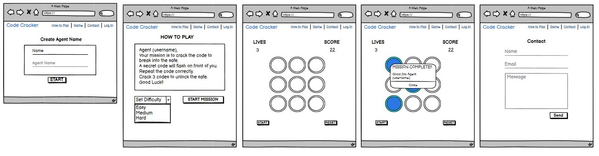
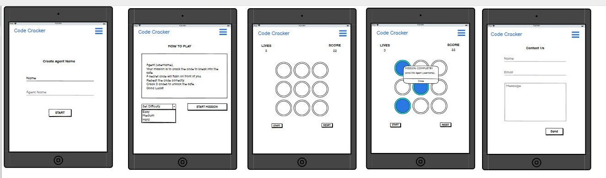
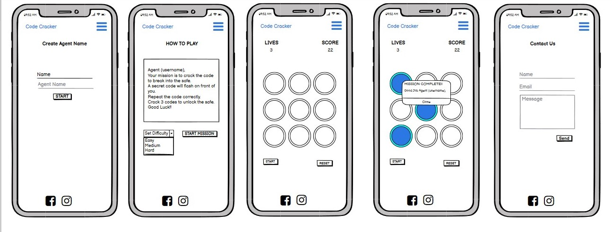

# Code Cracker
A memory game built with HTML, CSS, JavaScript
# Table of Contents
- [Introduction]
- [UX]
    - [Site Demographic]
    - [Scope]
    - [Design]
    - [User Stories]
    - [Site User Goals]
    - [Site Owner Goals]
    - [Wireframes]
- [Features]
    - [Common Features]
    - [Contact]
    - [Features Left to Implement]
- [Technologies Used]
- [Testing]
    - [Testing User Stories]
    - [Bugs in Development]
- [Deployment]
- [Credits]
- [Media]
- [Acknowledgements]
____
# Code Cracker
Code Cracker is an interactive memory game which is designed to test users working memory. The aim of this game is to give users an indication of what their short term memory is like compaired to the average person. 

# UX

## Scope
___
I want the users of this site to feel like they are being challenged.

## Site Structure
___
- This site is split into 4 pages. Log In, How to Play, Game Page, Contact Page
- There is a responsive navbar on each page of the site which is created using [Bootstrap](https://getbootstrap.com).
- The Log In page is where users can sign in and create their agent name which is displayed at different times throughout the site.
- 
## User Stories
___
- As a user I want to practice improving my short term memory.
- As a user I want to see what my score is during the game.
- As a user I want multiple attempts at cracking the code.
- As a user I want to see where my memory skill are compared to others.
- As a user I want the game to be visually appealing.
- As a user I want the game to be intuitive and easy to use.

## Site Owner
___
- As a site owner I want to practice improving my memory skills.
- As a site owner I want this site to be responsive across multiple devices
- As a site owner I want users to feel like they are having a personal experience using the game.
- As a site owner I want the UI to look clean and minimal.
- As a site owner I want users to have a way to contact us to suggest improvements.

# Design
## Colour Pallet
___
The colors that are used throughout this site are taken form [Coolers](https://coolors.co/). I wanted to keep the main background of the site dark for two reasons. Its in keeping with the secret spy narritive and I found that its easier on users eyes to focus when the screen is darker.

|Application|Color Code|Preview|
|----------|----------|-------|
|Background|#17181f||
|Navbar Links|#6c72cb||
|Game Area|#cb69c1||
|Body Text|#eeedf0||

## Wireframes
___
Below are the wireframes I created using [Balsamiq](https://balsamiq.com/).

Desktop

Tablet

Mobile
